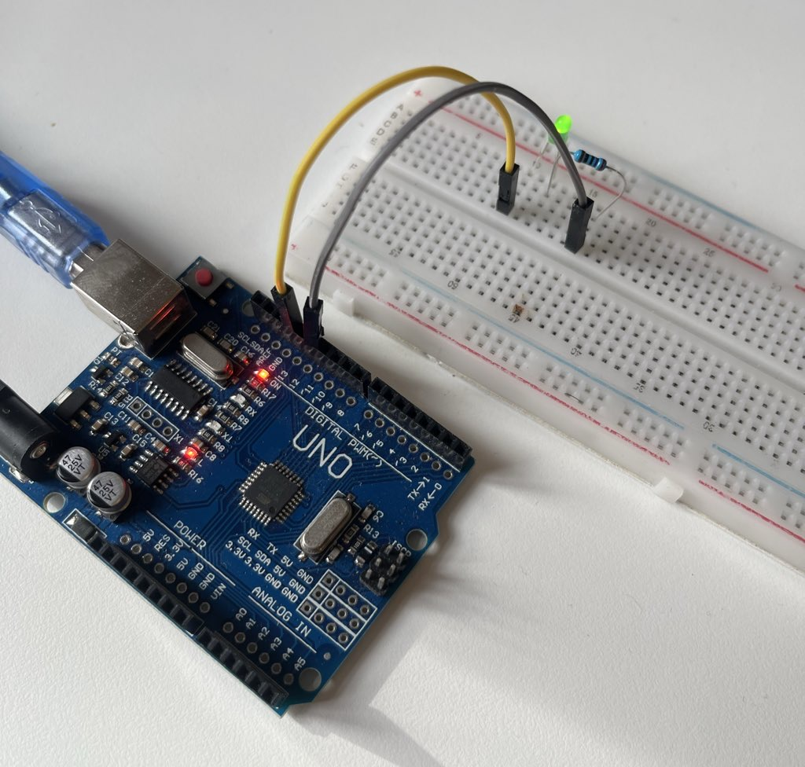
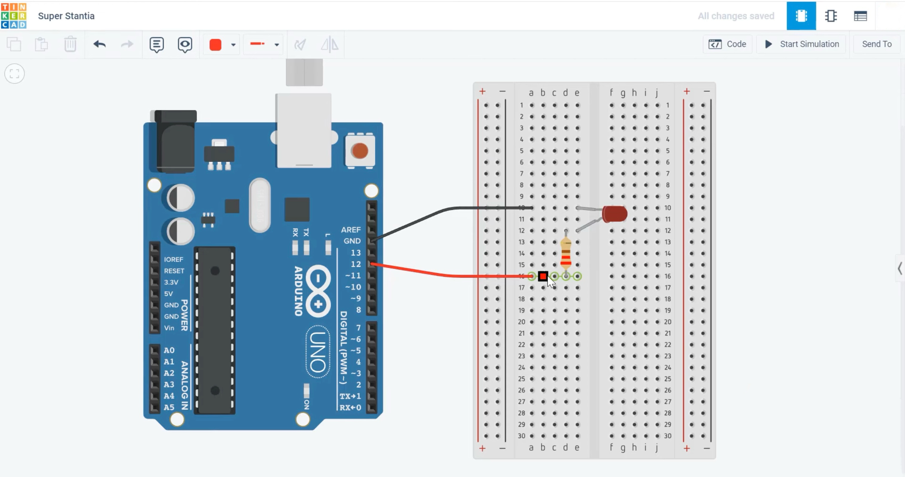

# 💡 Blinking LED with Arduino UNO

A simple introductory Arduino project demonstrating how to make an LED blink using a digital output pin.  
This experiment is often the very first step in learning microcontroller programming and circuit prototyping.

---

## ⚙️ Components Used

| Component | Quantity | Description |
|------------|-----------|--------------|
| Arduino UNO | 1 | Main microcontroller board |
| LED (green) | 1 | Standard 5mm LED |
| 270 Ω Resistor | 1 | Current-limiting resistor |
| Breadboard | 1 | For circuit assembly |
| Jumper Wires | 2 | For connections |
| USB Cable (Type-A to Type-B) | 1 | To connect Arduino to computer |

---

## 🔌 Circuit Connection

| Arduino Pin | Connection |
|--------------|-------------|
| **D12** | → Resistor → LED anode (long leg) |
| **GND** | → LED cathode (short leg) |

➡️ The resistor must be **in series** with the LED to protect it from excess current.

---

## 🧠 Code

```cpp
void setup() {
  pinMode(12, OUTPUT);
}

void loop() {
  digitalWrite(12, HIGH);
  delay(1000);
  digitalWrite(12, LOW);
  delay(1000);
}
```

💡 This code turns the LED ON for one second and OFF for one second continuously.

---

## 🖼️ Circuit Overview

### 🔧 Breadboard Setup


### 📘 Schematic Diagram


---

## 🚀 How to Run

1. Connect your Arduino UNO via USB.  
2. Open the `.ino` file in the Arduino IDE.  
3. Select **Tools → Board → Arduino Uno**.  
4. Select the correct **Port** (e.g., `/dev/cu.usbserial-xxx`).  
5. Click **Upload** (▶️).  
6. Watch the LED blink every second! ✨

---

## 🧩 Learning Highlights

- Digital output control using Arduino.  
- Series connection of resistor and LED.  
- Basic breadboard prototyping.  
- Simple delay-based timing in microcontrollers.

---

## 🪪 License

MIT License  
© 2025 Nooshin Pourkamali

---

### 🔖 Tags
`#arduino` `#electronics` `#led-blink` `#beginner-project` `#embedded`
