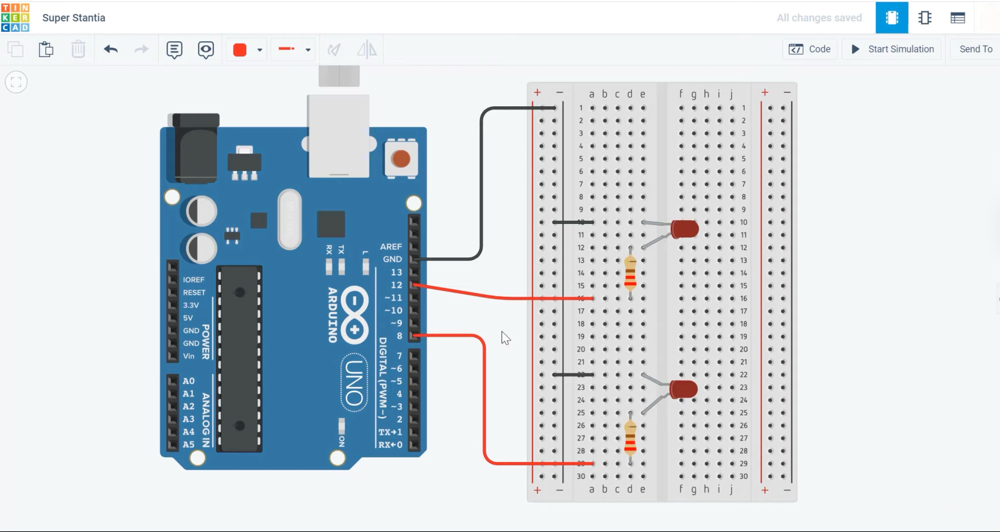

# 💡 Blinking Two LEDs with Arduino UNO

This project demonstrates how to make **two LEDs blink simultaneously** using an Arduino UNO.  
It builds on the classic single LED blink example and helps you understand how multiple digital pins can be controlled in parallel.

---

## ⚙️ Components Used

| Component | Quantity | Description |
|------------|-----------|--------------|
| Arduino UNO | 1 | Main microcontroller board |
| LED (green/red) | 2 | Light-emitting diodes |
| 270 Ω Resistors | 2 | Current-limiting resistors |
| Breadboard | 1 | For circuit assembly |
| Jumper Wires | Several | For connections |
| USB Cable (Type-A to Type-B) | 1 | To connect Arduino to computer |

---

## 🔌 Circuit Connection

| Arduino Pin | Breadboard Connection |
|--------------|----------------------|
| **D12** | → Resistor → LED1 anode (long leg) |
| **D11** | → Resistor → LED2 anode (long leg) |
| **GND** | → Both LED cathodes (short legs) |

➡️ Each LED must be connected in **series with its own resistor** to limit current.

---

## 🧠 Code

```cpp
void setup() {
  pinMode(12, OUTPUT);
  pinMode(11, OUTPUT);
}

void loop() {
  digitalWrite(12, HIGH);
  digitalWrite(11, HIGH);
  delay(1000);
  digitalWrite(12, LOW);
  digitalWrite(11, LOW);
  delay(1000);
}
```

💡 Both LEDs turn ON together for one second and OFF together for one second, creating a synchronized blink pattern.

---

## 🖼️ Circuit Overview

### 🔧 Breadboard Setup


### 📘 Schematic Diagram


---

## 🚀 How to Run

1. Connect your Arduino UNO via USB.  
2. Open the `Blinking_two_LEDs_.ino` file in the Arduino IDE.  
3. Select **Tools → Board → Arduino Uno**.  
4. Select the correct **Port** (e.g., `/dev/cu.usbserial-xxx`).  
5. Click **Upload** (▶️).  
6. Watch both LEDs blink together every second! ✨

---

## 🧩 Learning Highlights

- Controlling multiple output pins simultaneously.  
- Understanding digital I/O and timing with `delay()`.  
- Building simple parallel LED circuits.  
- Expanding from single to multiple device control in Arduino.

---

## 🪪 License

MIT License  
© 2025 Nooshin Pourkamali

---

### 🔖 Tags
`#arduino` `#electronics` `#led-blink` `#beginner-project` `#embedded` `#multi-output`
