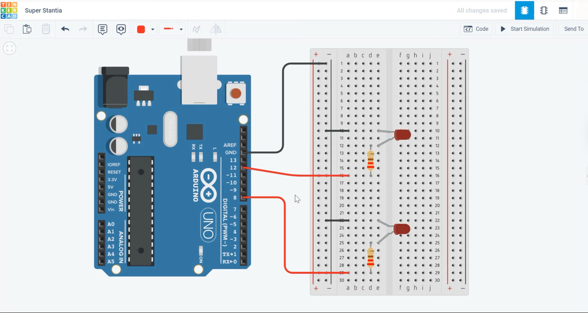
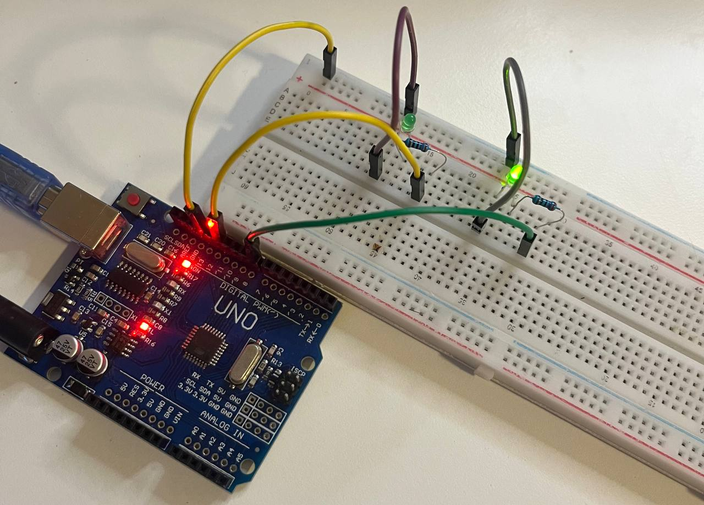
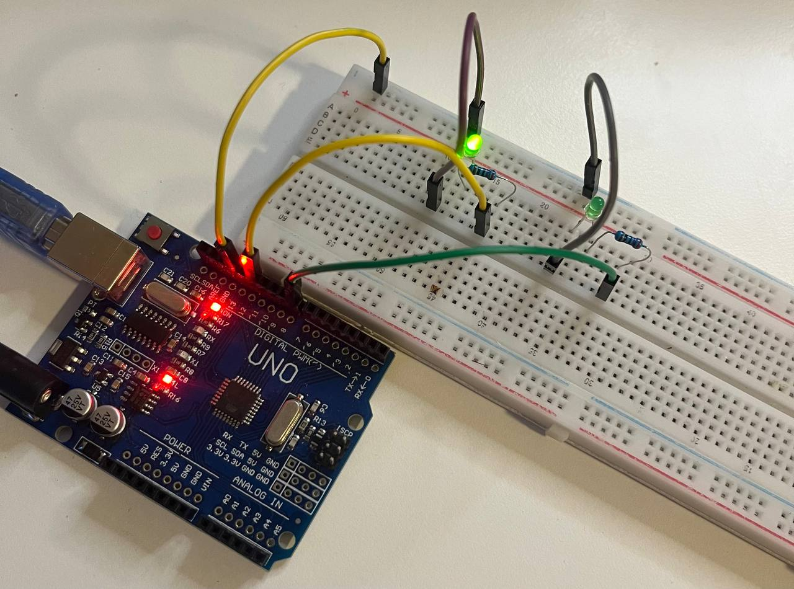

# 🔁 Alternating Two LEDs with Arduino UNO

This project demonstrates how to make **two LEDs blink alternately** using an Arduino UNO.  
When one LED is ON, the other is OFF — and they switch states continuously.  
It’s a simple yet essential experiment for learning about digital outputs, timing, and control flow in Arduino.

---

## ⚙️ Components Used

| Component | Quantity | Description |
|------------|-----------|-------------|
| Arduino UNO | 1 | Main microcontroller board |
| LED (any color) | 2 | Light-emitting diodes |
| 270 Ω Resistors | 2 | Current-limiting resistors for LEDs |
| Breadboard | 1 | For circuit assembly |
| Jumper Wires | Several | For connections |
| USB Cable (Type-A to Type-B) | 1 | To power and upload code |

---

## 🔌 Circuit Connection

| Arduino Pin | Connection |
|--------------|-------------|
| **D12** | → Resistor → LED1 anode (long leg) |
| **D11** | → Resistor → LED2 anode (long leg) |
| **GND** | → Both LED cathodes (short legs) |

➡️ Each LED is connected in **series with a resistor** to limit current.

---

## 🧠 Code

```cpp
int led1 = 12;
int led2 = 11;

void setup() {
  pinMode(led1, OUTPUT);
  pinMode(led2, OUTPUT);
}

void loop() {
  digitalWrite(led1, HIGH);
  digitalWrite(led2, LOW);
  delay(1000);

  digitalWrite(led1, LOW);
  digitalWrite(led2, HIGH);
  delay(1000);
}
```

💡 The LEDs alternate every 1 second:
- LED1 turns ON while LED2 is OFF.  
- Then LED1 turns OFF and LED2 turns ON.  
This loop continues indefinitely.

---

## 🖼️ Circuit Overview

### 📘 Schematic Diagram


### 🔧 Breadboard Setup



---

## 🚀 How to Run

1. Connect your Arduino UNO via USB.  
2. Open the `.ino` file in the **Arduino IDE**.  
3. Select **Tools → Board → Arduino Uno**.  
4. Select the correct **Port** (e.g., `/dev/cu.usbserial-xxx`).  
5. Upload the code (▶️).  
6. Watch the LEDs blink alternately! ✨

---

## 🧩 Learning Highlights

- Using digital output pins with `digitalWrite()`.  
- Understanding how timing with `delay()` creates visual effects.  
- Applying logic patterns for alternating control.  
- Simple logic foundation for future multi-LED or pattern-based projects.

---

## 🪪 License

MIT License  
© 2025 Nooshin Pourkamali

---

### 🔖 Tags
`#arduino` `#electronics` `#alternating-leds` `#beginner-project` `#embedded` `#digital-logic` `#timing`
