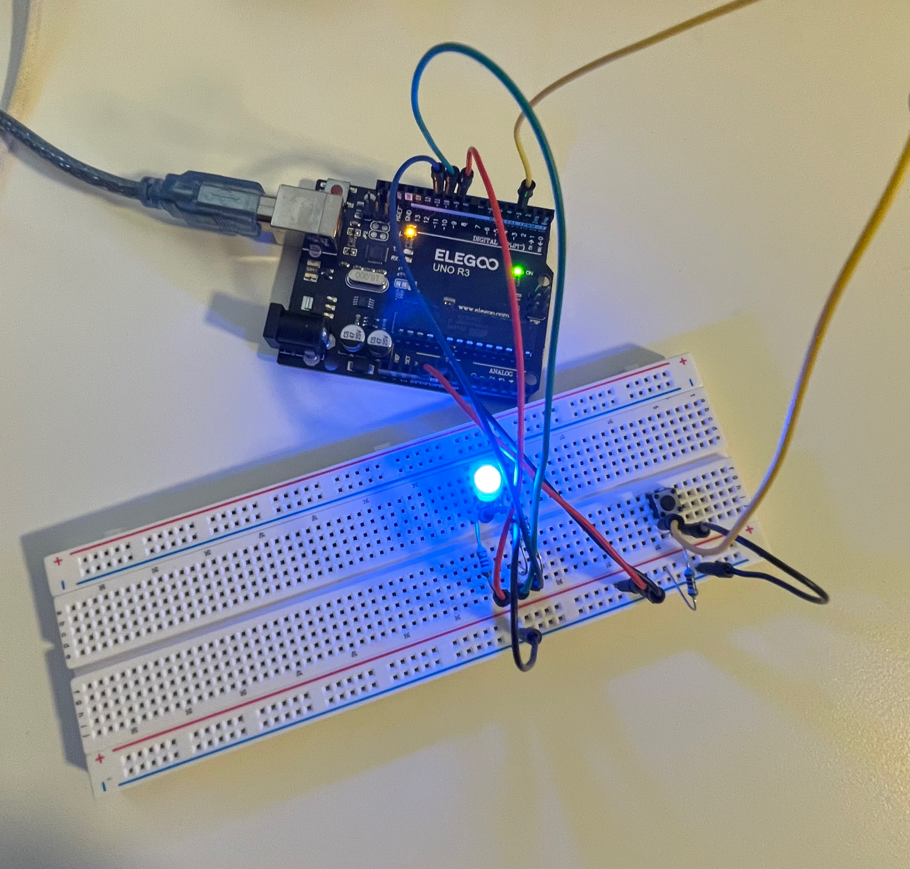
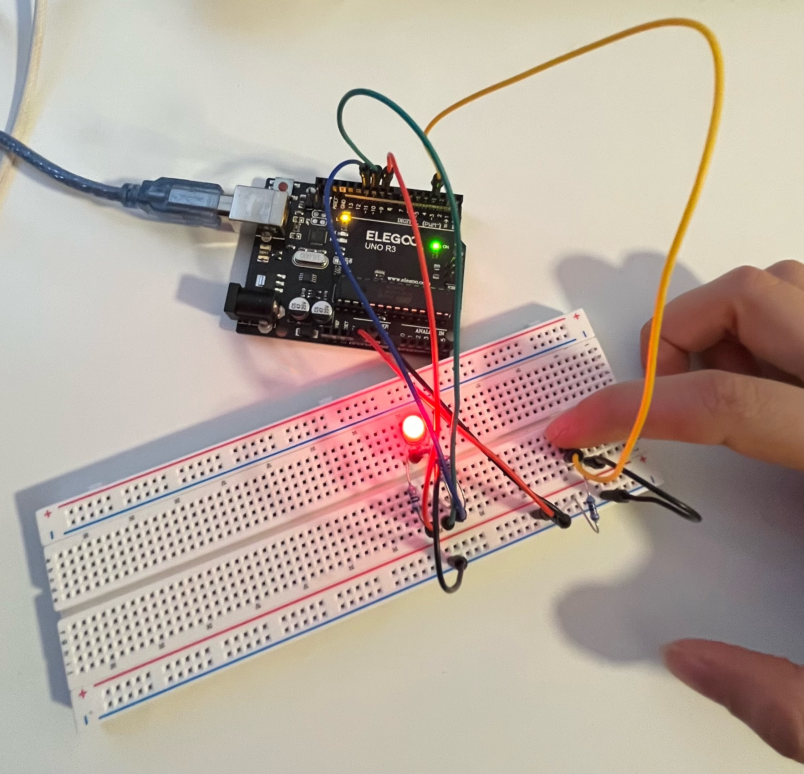
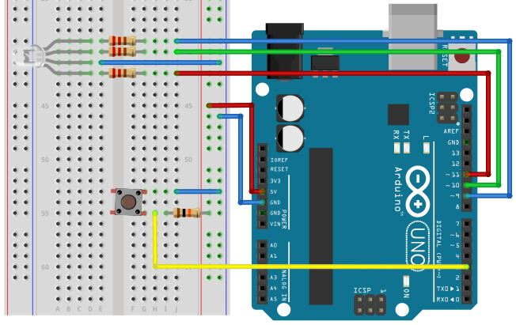

# 🔴🟢🔵 RGB LED Color Change with Button (Arduino UNO / Elegoo UNO R3)

A simple Arduino project where an **RGB LED changes color each time you
press a button**.\
This experiment helps you learn **digital inputs**, **RGB LED control**,
and **state-based programming**.

------------------------------------------------------------------------

## ⚙️ Components Used

  Component                      Quantity   Description
  ------------------------------ ---------- ------------------------------------
  Arduino UNO / Elegoo UNO R3    1          Main microcontroller board
  RGB LED (common cathode)       1          4‑pin RGB LED
  220--330 Ω Resistors           3          One for each LED channel (R, G, B)
  Push Button                    1          Momentary tactile button
  10 kΩ Resistor                 1          Pull‑down resistor for button
  Breadboard                     1          For prototyping
  Jumper Wires                   Several    For connections
  USB Cable (Type‑A to Type‑B)   1          For programming & power

------------------------------------------------------------------------

## 🔌 Circuit Connection

### ▶️ RGB LED Pins

  Arduino Pin   RGB LED Pin
  ------------- ----------------------
  **D9**        Red (via resistor)
  **D10**       Green (via resistor)
  **D11**       Blue (via resistor)
  **GND**       Common cathode

------------------------------------------------------------------------

### ▶️ Button Connections

  Arduino Pin   Button Connection
  ------------- ----------------------------------
  **D3**        Button output
  **5V**        Opposite leg of button
  **GND**       Through 10 kΩ pull‑down resistor

➡️ The button uses a **pull‑down resistor** to ensure stable LOW
readings when not pressed.

------------------------------------------------------------------------

## Code

``` cpp
const int redPin = 9;
const int greenPin = 10;
const int bluePin = 11;
const int buttonPin = 3;

int counter = 0;
int lastButtonState = LOW;

void setup() {
  pinMode(redPin, OUTPUT);
  pinMode(greenPin, OUTPUT);
  pinMode(bluePin, OUTPUT);
  pinMode(buttonPin, INPUT);
}

void loop() {
  int state = digitalRead(buttonPin);

  if (state == HIGH && lastButtonState == LOW) {
    counter++;
    delay(200);
  }
  lastButtonState = state;

  if (counter == 0) {
    digitalWrite(redPin, LOW);
    digitalWrite(greenPin, LOW);
    digitalWrite(bluePin, LOW);
  } else if (counter == 1) {
    digitalWrite(redPin, HIGH);
    digitalWrite(greenPin, LOW);
    digitalWrite(bluePin, LOW);
  } else if (counter == 2) {
    digitalWrite(redPin, LOW);
    digitalWrite(greenPin, HIGH);
    digitalWrite(bluePin, LOW);
  } else if (counter == 3) {
    digitalWrite(redPin, LOW);
    digitalWrite(greenPin, LOW);
    digitalWrite(bluePin, HIGH);
  } else if (counter == 4) {
    digitalWrite(redPin, HIGH);
    digitalWrite(greenPin, LOW);
    digitalWrite(bluePin, HIGH);
  } else {
    counter = 0;
  }
}
```

------------------------------------------------------------------------

## 🖼️ Circuit Overview

### 🔧 Breadboard Setup



### 📘 Schematic Diagram


------------------------------------------------------------------------

## 🚀 How to Run

1.  Connect your Arduino UNO via USB.\
2.  Open the `.ino` file in the Arduino IDE.\
3.  Select **Tools → Board → Arduino Uno**.\
4.  Select the correct **Port** (`/dev/cu.usbserial-xxx`).\
5.  Click **Upload** (▶️).\
6.  Press the button to cycle through LED colors! 🌈🔘

------------------------------------------------------------------------

## 🧩 Learning Highlights

-   Using **digital input** to detect button presses\
-   Controlling **RGB LED channels**\
-   Managing **state changes** using a counter\
-   Building clean breadboard prototypes\
-   Understanding pull‑down resistors and stable input logic

------------------------------------------------------------------------

## 🪪 License

MIT License\
© 2025 Nooshin Pourkamali

------------------------------------------------------------------------

### 🔖 Tags

`#arduino` `#electronics` `#rgb-led` `#button` `#embedded`
`#beginner-project`
