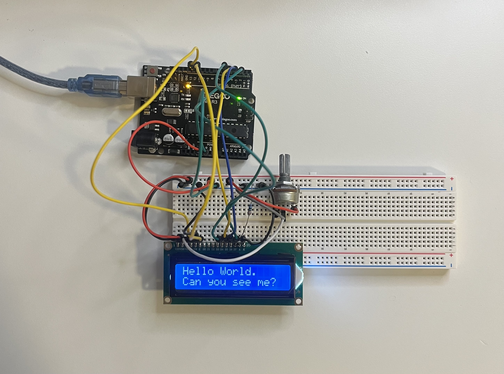
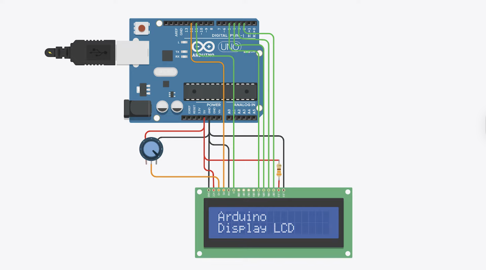

# 📟 Arduino LCD Display Text Project

This project demonstrates how to display custom text on a **16x2 LCD**
using an **Arduino UNO / Elegoo UNO R3**.\
You will learn how to wire a parallel LCD, adjust contrast using a
potentiometer, and print text to the screen.

------------------------------------------------------------------------

## ⚙️ Components Used

  Component                       Quantity   Description
  ------------------------------- ---------- ----------------------------
  Arduino UNO / Elegoo UNO R3     1          Main microcontroller board
  16x2 LCD (HD44780 compatible)   1          Parallel character LCD
  10 kΩ Potentiometer             1          Controls LCD contrast
  220 Ω Resistor                  1          Backlight current‑limiting
  Breadboard                      1          For prototyping
  Jumper Wires                    Several    Connections
  USB Cable                       1          Power & programming

------------------------------------------------------------------------

## 🔌 Circuit Connection

### LCD Pin Mapping

  LCD Pin   Function          Arduino Pin
  --------- ----------------- --------------------------
  **VSS**   Ground            GND
  **VDD**   +5V               5V
  **VO**    Contrast          Potentiometer middle pin
  **RS**    Register Select   D12
  **RW**    Read/Write        GND
  **E**     Enable            D11
  **D4**    Data 4            D5
  **D5**    Data 5            D4
  **D6**    Data 6            D3
  **D7**    Data 7            D2
  **A**     Backlight +       5V via 220Ω resistor
  **K**     Backlight --      GND

### Potentiometer Wiring

-   One outer pin → **5V**\
-   Other outer pin → **GND**\
-   Middle pin → **VO** (LCD pin 3)

------------------------------------------------------------------------

## 🧠 Code (`Display_LCD.ino`)

``` cpp
#include <LiquidCrystal.h>

const int rs = 12, en = 11, d4 = 5, d5 = 4, d6 = 3, d7 = 2;
LiquidCrystal lcd(rs, en, d4, d5, d6, d7);

void setup() {
  lcd.begin(16, 2);
  lcd.setCursor(0, 0);
  lcd.print("Arduino");
  lcd.setCursor(0, 1);
  lcd.print("Display LCD");
}

void loop() {
}
```

------------------------------------------------------------------------

## 🖼️ Circuit Overview

### 🔧 Breadboard Setup



### 📘 Wiring Diagram



------------------------------------------------------------------------

## 🚀 How to Run

1.  Connect your Arduino to the laptop using USB.\
2.  Open **Display_LCD.ino** in the Arduino IDE.\
3.  Select **Tools → Board → Arduino Uno**.\
4.  Select the correct **Port**.\
5.  Click **Upload** (▶).\
6.  Turn the potentiometer until the text appears clearly on the LCD.

------------------------------------------------------------------------

## 🧩 Learning Highlights

-   Using the **LiquidCrystal** library\
-   Controlling an LCD in **4‑bit mode**\
-   Adjusting LCD contrast\
-   Understanding RS, E, D4--D7 pin functions\
-   Sending text to specific cursor positions

------------------------------------------------------------------------

## 🪪 License

MIT License\
© 2025 Nooshin Pourkamali

------------------------------------------------------------------------

### 🔖 Tags

`#arduino` `#lcd` `#display` `#electronics` `#beginner-project`
