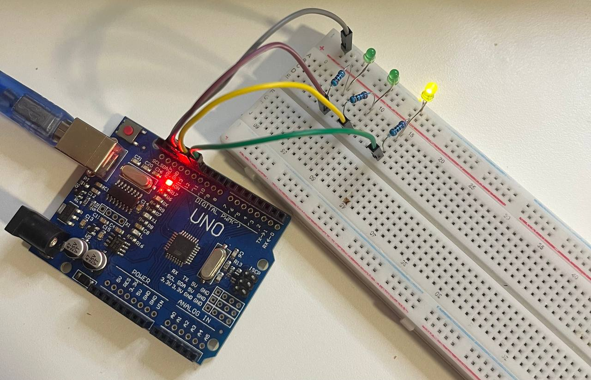
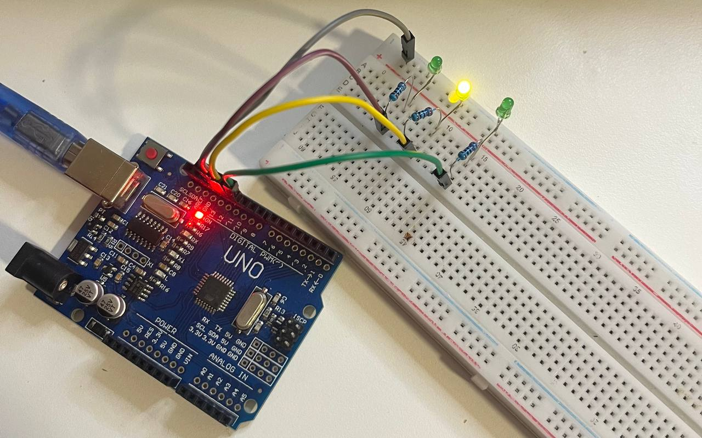
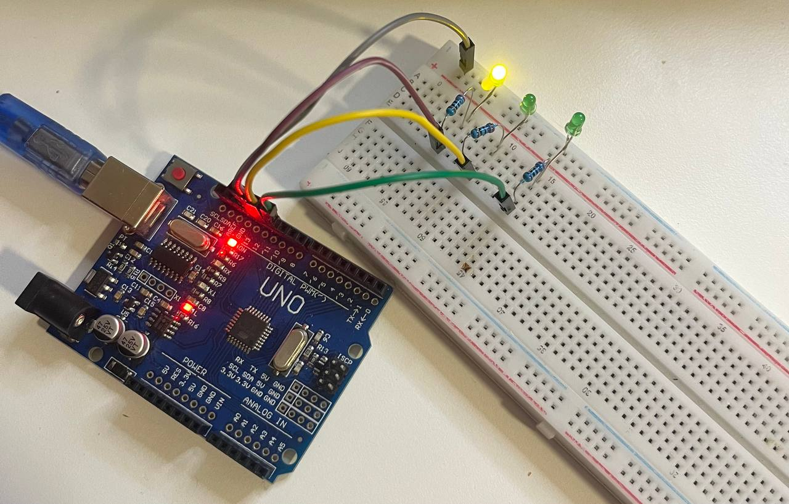

# 🚦 Traffic Light Simulation with Arduino UNO

This project simulates a **basic traffic light system** using three LEDs (red, yellow, and green) connected to an Arduino UNO.  
It demonstrates the concept of sequential timing and digital output control, which is fundamental for embedded systems and automation logic.

---

## ⚙️ Components Used

| Component | Quantity | Description |
|------------|-----------|-------------|
| Arduino UNO | 1 | Main microcontroller board |
| Red LED | 1 | Represents STOP signal |
| Yellow LED | 1 | Represents READY / WAIT signal |
| Green LED | 1 | Represents GO signal |
| 270 Ω Resistors | 3 | Current-limiting resistors for each LED |
| Breadboard | 1 | For prototyping |
| Jumper Wires | Several | For electrical connections |
| USB Cable (Type-A to Type-B) | 1 | To power and program the Arduino |

---

## 🔌 Circuit Connection

| Arduino Pin | LED Color | Connection |
|--------------|------------|-------------|
| **D10** | Green | → Resistor → LED anode (long leg) |
| **D11** | Yellow | → Resistor → LED anode (long leg) |
| **D12** | Red | → Resistor → LED anode (long leg) |
| **GND** | All LEDs | → LED cathodes (short legs) |

Each LED is connected in **series with its own resistor** to prevent overcurrent.

---

## 🧠 Code

```cpp
int red = 12;
int yellow = 11;
int green = 10;

void setup() {
  pinMode(red, OUTPUT);
  pinMode(yellow, OUTPUT);
  pinMode(green, OUTPUT);
}

void loop() {
  // Red ON for 3 seconds
  digitalWrite(red, HIGH);
  delay(3000);
  digitalWrite(red, LOW);

  // Yellow ON for 1 second
  digitalWrite(yellow, HIGH);
  delay(1000);
  digitalWrite(yellow, LOW);

  // Green ON for 3 seconds
  digitalWrite(green, HIGH);
  delay(3000);
  digitalWrite(green, LOW);
}
```

💡 This code mimics a real traffic light cycle:
1. Red stays ON for 3 seconds (Stop).  
2. Yellow stays ON for 1 second (Prepare).  
3. Green stays ON for 3 seconds (Go).  
Then the sequence repeats infinitely.

---

## 🖼️ Circuit Overview

### 📘 Schematic Diagram  


### 🔧 Breadboard Setup  
| View | Description |
|------|--------------|
|  | Full breadboard view with all three LEDs |
|  | Yellow LED active (transition state) |
|  | Green LED active (GO signal) |

---

## 🚀 How to Run

1. Connect your Arduino UNO via USB.  
2. Open the `.ino` file in the **Arduino IDE**.  
3. Select **Tools → Board → Arduino Uno**.  
4. Select the correct **Port** (e.g., `/dev/cu.usbserial-xxx`).  
5. Upload the code (▶️).  
6. Observe the LEDs blinking in the correct traffic-light sequence.

---

## 🧩 Learning Highlights

- Sequential control using Arduino delay functions.  
- Understanding digital output and timing.  
- Practical use of resistors to protect LEDs.  
- A simple model of real-world traffic control logic.

---

## 🪪 License

MIT License  
© 2025 Nooshin Pourkamali

---

### 🔖 Tags
`#arduino` `#electronics` `#traffic-light` `#beginner-project` `#embedded` `#timing` `#automation`
