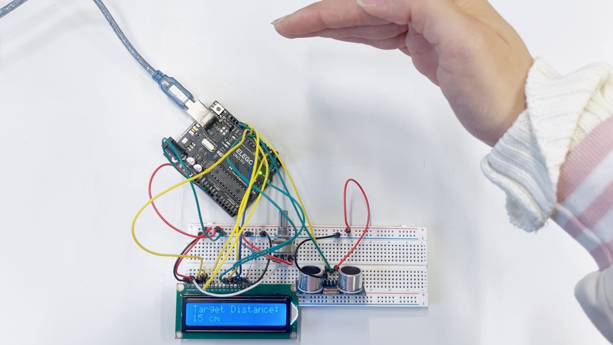
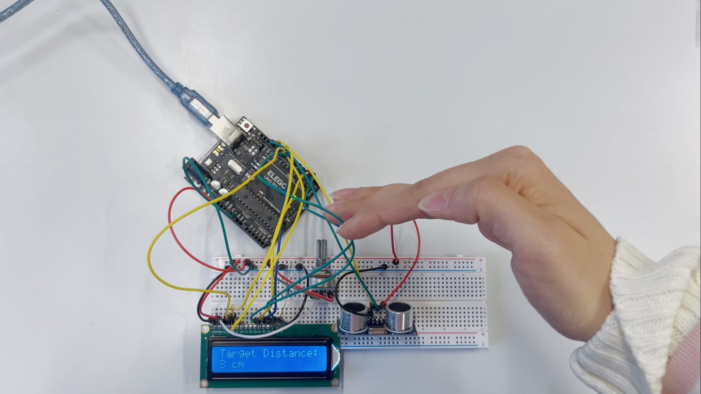

# 📏 Ultrasonic Distance Measurement with Arduino + HC-SR04 + LCD

Measure the distance to your hand (or any object) using an **HC-SR04 ultrasonic sensor** and show the result in real time on a **16×2 LCD**.

The project runs on an **Elegoo / Arduino UNO** and is perfect as a first contact-less measurement experiment.

---

## 📸 Project Preview

> Replace the file names with the real paths in your repo.





---

## ✨ Features

- Distance measurement roughly from **2 cm to 400 cm**
- Real-time display on a **16×2 LCD**
- Uses only **digital I/O pins** (no analog read needed)
- Demonstrates **ultrasonic sensing**, **timing**, and **LCD interfacing**

---

## 🧰 Components

- 1 × Arduino / Elegoo UNO R3  
- 1 × HC-SR04 ultrasonic distance sensor  
- 1 × 16×2 character LCD (parallel, 4-bit mode)  
- Breadboard  
- Jumper wires  
- Potentiometer (for LCD contrast, optional but recommended)  

---

## 🔌 Wiring

### HC-SR04 → Arduino

| HC-SR04 Pin | Arduino Pin |
|------------|-------------|
| VCC        | 5V          |
| GND        | GND         |
| Trig       | D9          |
| Echo       | D10         |

### LCD (4-bit mode) → Arduino

| LCD Pin | Arduino Pin / Connection         |
|---------|----------------------------------|
| VSS     | GND                              |
| VDD     | 5V                               |
| VO      | Potentiometer middle pin (contrast) |
| RS      | D7                               |
| RW      | GND                              |
| E       | D6                               |
| D4      | D5                               |
| D5      | D4                               |
| D6      | D3                               |
| D7      | D2                               |
| A (LED+) | 5V through ~220 Ω resistor      |
| K (LED−) | GND                              |

Your Fritzing diagram shows exactly this wiring.

---

## 🧠 How the HC-SR04 Works (Simple Version)

1. The Arduino sends a **very short HIGH pulse (10 µs)** to the **Trig** pin.  
2. The sensor sends out an **8-cycle ultrasonic “ping”** at **40 kHz**.  
3. The sound hits an object (your hand) and bounces back.  
4. While the sensor is waiting for the echo, it keeps the **Echo** pin HIGH.  
5. When the echo arrives, **Echo goes LOW again**.  
6. The **length of time Echo stayed HIGH** is proportional to the distance.  

The Arduino measures this time (in microseconds) and converts it to centimeters:

```text
distance_cm = duration_microseconds / 58.0

## Code Used
(From your uploaded .ino file)

```cpp
/*
HC-SR04 Ultrasonic Sensor with LCD dispaly

HC-SR04 Ultrasonic Sensor
  VCC to Arduino 5V
  GND to Arduino GND
  Echo to Arduino pin 12
  Trig to Arduino pin 13

LCD Display (I used JHD162A) 
  VSS to Arduino GND
  VCC to Arduino 5V
  VEE to Arduino GND
  RS to Arduino pin 11
  R/W to Arduino pin 10
  E to Arduino pin 9
  DB4 to Arduino pin 2
  DB5 to Arduino pin 3
  DB6 to Arduino pin 4
  DB7 to Arduino pin 5
  LED+ to Arduino 5V
  LED- to Arduino GND
  
Modified by Ahmed Djebali (June 1, 2015).
*/
#include <LiquidCrystal.h> //Load Liquid Crystal Library
LiquidCrystal LCD(11,10,9,2,3,4,5);  //Create Liquid Crystal Object called LCD

#define trigPin 13 //Sensor Echo pin connected to Arduino pin 13
#define echoPin 12 //Sensor Trip pin connected to Arduino pin 12

//Simple program just for testing the HC-SR04 Ultrasonic Sensor with LCD dispaly 
//URL:

void setup() 
{  
  pinMode(trigPin, OUTPUT);
  pinMode(echoPin, INPUT);
  
  LCD.begin(16,2); //Tell Arduino to start your 16 column 2 row LCD
  LCD.setCursor(0,0);  //Set LCD cursor to upper left corner, column 0, row 0
  LCD.print("Target Distance:");  //Print Message on First Row
}

void loop() {
  long duration, distance;
  digitalWrite(trigPin, LOW);
  delayMicroseconds(2);
  digitalWrite(trigPin, HIGH);
  delayMicroseconds(10);
  digitalWrite(trigPin, LOW);
  duration = pulseIn(echoPin, HIGH);
  distance = (duration/2) / 29.1;

  LCD.setCursor(0,1);  //Set cursor to first column of second row
  LCD.print("                "); //Print blanks to clear the row
  LCD.setCursor(0,1);   //Set Cursor again to first column of second row
  LCD.print(distance); //Print measured distance
  LCD.print(" cm");  //Print your units.
  delay(250); //pause to let things settle
}


```
