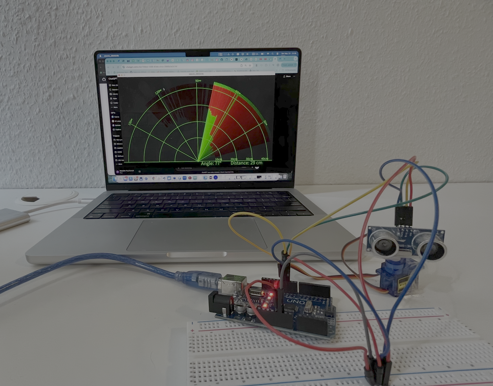

# Arduino Ultrasonic Radar System

A radar-style visualization project built using Arduino, HC-SR04 ultrasonic sensor, servo motor, and Processing IDE.

## Demo

<video width="500" controls>
  <source src="https://github.com/user-attachments/assets/9cff4255-379f-4685-9baf-bff4bd61cdeb" type="video/mp4">
</video>

## Features

- Real-time radar sweep visualization
- Distance detection using ultrasonic sensor
- Servo-based scanning system
- Processing GUI radar display

## Components Used

- Arduino Uno
- HC-SR04 Ultrasonic Sensor
- SG90 Servo Motor
- Jumper wires
- Breadboard

## Software

- Arduino IDE
- Processing IDE

## Wiring

| Component | Arduino Pin |
|---|---|
| HC-SR04 Trig | D10 |
| HC-SR04 Echo | D11 |
| Servo Signal | D12 |

## How It Works

The servo rotates the ultrasonic sensor between 15° and 165°.  
Distance measurements are sent through serial communication to Processing IDE, which visualizes the radar sweep and detected objects.

## Demo

(Add screenshots or GIF here)

## Future Improvements

- Obstacle alert buzzer
- OLED display
- Better radar UI
- Object tracking
- React/Web dashboard version

## Author

Nooshin Pourkamali
