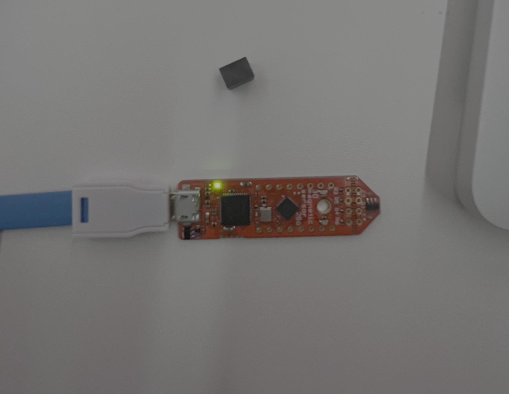
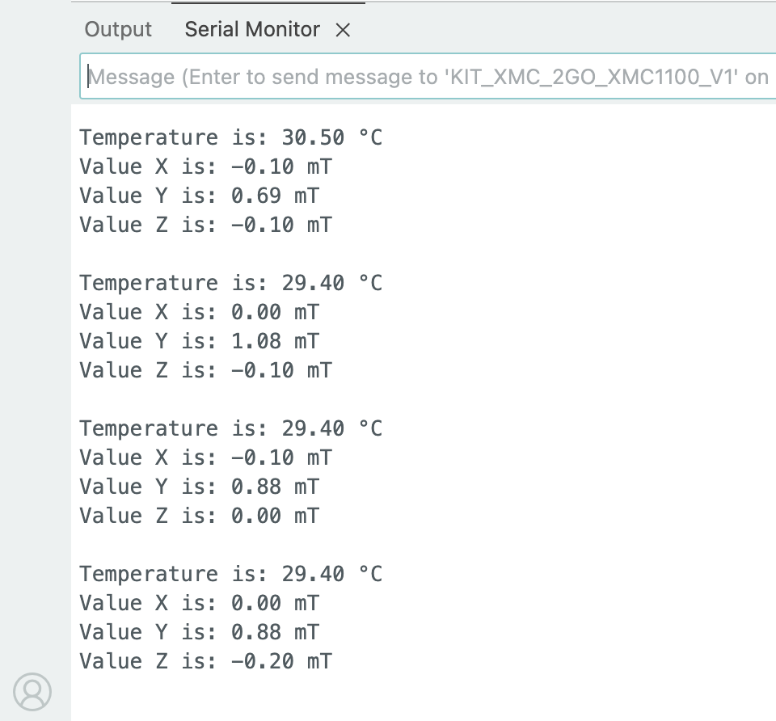

# XMC1100 Magnetic Field & Temperature Sensor

Embedded systems project using the Infineon XMC1100 Kit2Go board and TLx493D 3D magnetic sensor.

The system reads:

- Magnetic field values in X, Y, Z directions
- Temperature values
- Real-time sensor output through the Serial Monitor

---

## Hardware

- Infineon XMC1100 Kit2Go
- TLx493D-A1B6 3D Magnetic Sensor
- SEGGER J-Link Debugger

---

## Features

- Real-time magnetic field sensing
- Temperature monitoring
- Serial communication output
- Arduino IDE support
- ARM Cortex-M0 microcontroller

---

## Technologies Used

- Arduino IDE
- Embedded C/C++
- Infineon XMC Boards Package
- TLx493D Sensor Library
- I2C Communication

---

## Board Configuration

Board used:

```text
XMC1100-0064
```

Serial baud rate:

```text
115200
```

---

## Example Output

```text
Temperature is: 33.80 °C
Value X is: 0.10 mT
Value Y is: 0.20 mT
Value Z is: -0.10 mT
```

---

## Project Structure

```text
XMC1100_Magnetic_Sensor/
│
├── XMC1100_Magnetic_Sensor.ino
├── README.md
└── assets/
```

---

## Setup

1. Install Arduino IDE
2. Install Infineon XMC Boards package
3. Select board:

```text
XMC1100-0064
```

4. Select the J-Link serial port
5. Upload the sketch
6. Open Serial Monitor at 115200 baud

---

## Sensor Output Demonstration

Add your images inside:

```text
assets/
```

Example:

```md



```

---

## Notes

The TLx493D-A1B6 sensor does not support `setSensitivity()`.
Unsupported API calls were removed to stabilize readings.

---

## Author

Nooshin Pourkamali
